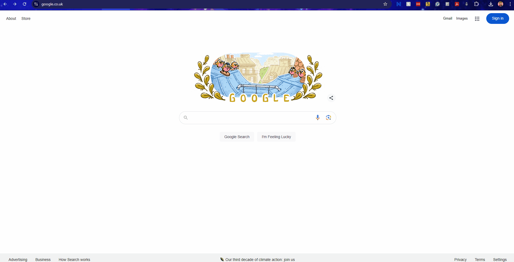

# frontend-terraform (Cloud Resume Challenge - Terraform)

Welcome!!!

This is where my first ever Terraform, fully deployable, Resume website is!!!
This is the infrastructure for the frontend of the blog site. This houses my Resume infrastructure.

So whenever I make an edit in my repo here, that translates to my AWS infrastructure. It looks something like this:

## Frontend

This repository handles the frontend of my infrastructure, linking to my backend github repository. And as a fail-safe for users when I update, I messed with this CSS and Javascript run **web terminal** for them to mess with until the visuals ar back up and running!

